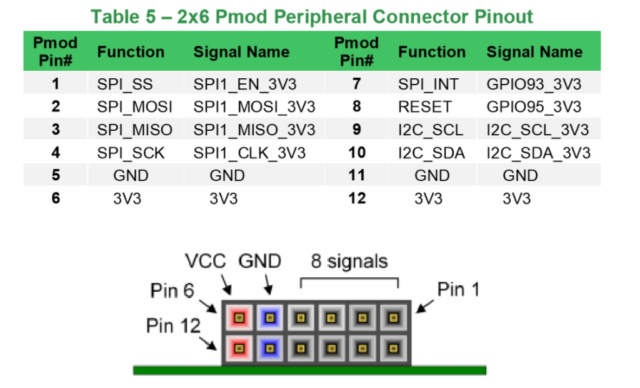
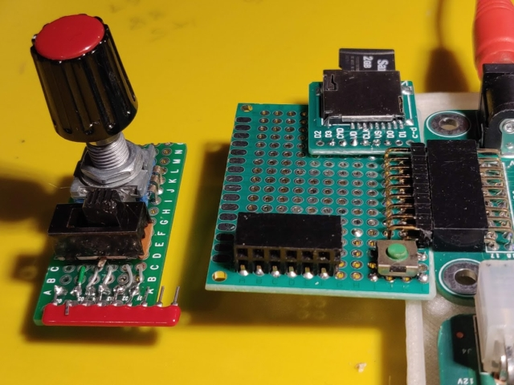
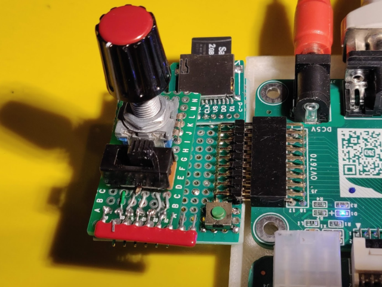
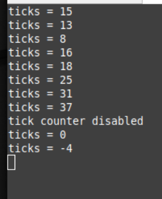

# Pmod interface

[pmod interface specification](https://reference.digilentinc.com/_media/reference/pmod/pmod-interface-specification-1_2_0.pdf)

The Digilent Pmod interface is used to connect low frequency, low I/O pin count peripheral modules to host
controller boards. There are six-pin and twelve-pin versions of the interface defined, encompassing SPI, I²C, UART,
I2S, H-bridge and GPIO protocols. The six-pin version provides four digital I/O signal pins, one power pin and one
ground pin. The twelve-pin version provides eight I/O signal pins, two power pins and two ground pins. The signals
of the twelve-pin version are arranged so that it provides two of the six-pin interfaces stacked.

## connector example

## Digilent pmod IP library

The Digilent pmod library for zynq contains lots of Ip and example code to demo the library in a very easy to use way. The library is here: https://github.com/Digilent/vivado-library A document describing how to use it with an easy to follow walk through is here: https://reference.digilentinc.com/reference/programmable-logic/guides/getting-started-with-pmod-ips.

## prototype hardware 

The example walk trrough uses the pmod-enc IP together with a Digilent rotary encode pmod, a similar board was prototyped to allow testing of the complete project. The prototype board has a simplified circuit, pull-up resistors were added afterwards (red sil network) when I realized that I didnt know how to add pull-ups to the pin definitions in the board definition file (todo, find out)

The Diigilent pmod encoder is described here: [pmod-enc](https://reference.digilentinc.com/reference/pmod/pmodenc/reference-manual)
The prototype board has all inputs switching to -ve, with 10k pull-up resitors to +ve. The series resistors are ommited - there are series resistors on the ebaz board inputs.

Pmod interface socket with pmod encoder board

## demo application running

The board connected up and ready to go

Terminal output from demo application

