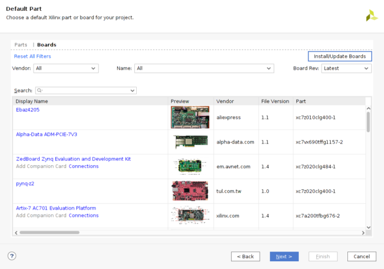
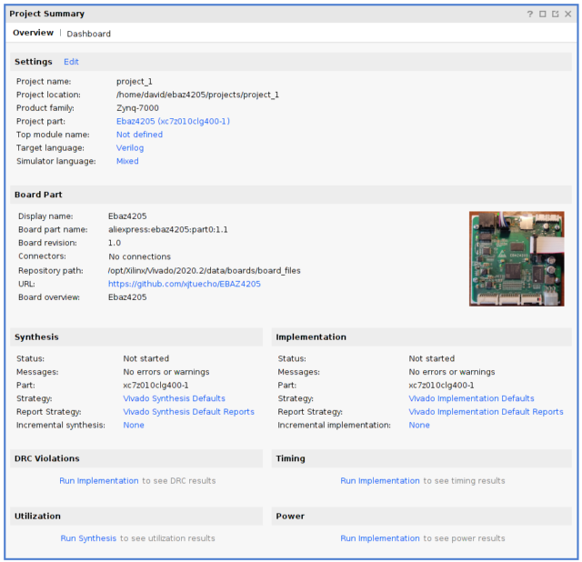
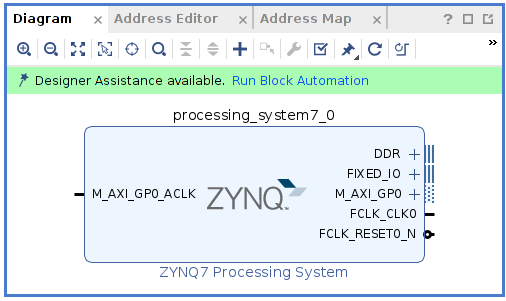
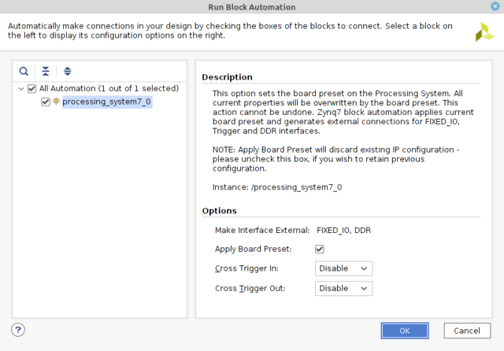
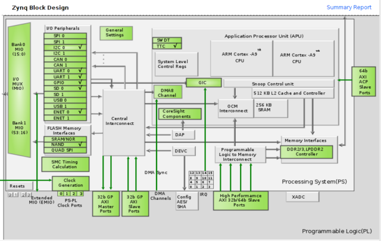
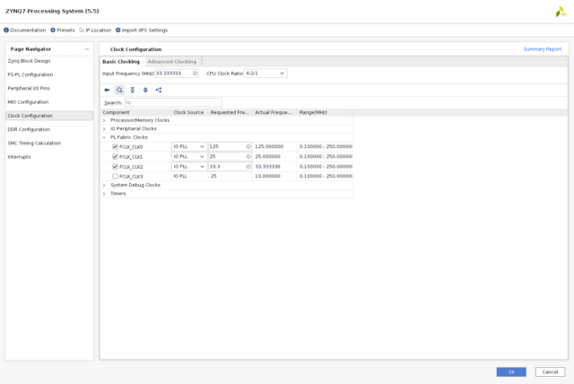
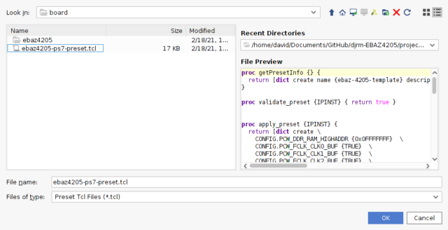

# Board definition files

a new pre-defined board 'Ebaz4205' to select the processor type and some i/o desinitions. Copy into <base>/Xilinx/Vivado/2020.2/data/boards
[ebaz4205 board files](./ebaz4205)

## create project

### select board

### board selected

## configure ps7 

When a block design with the ps7 is created the system offers to 'run block automation'

An option is to 'Apply Board Preset', this is configured to set the neccessary values to make the memory and other devices work. The parameters are in the presets.xml found in the board files

## show configuration

An overview of the applied settings is shown here:

## configure ps7 - alternative method

Before the board preset was configured a .tcl script was used to perform a similar purpose

A new board preset to automatically configure the i/o devices and memory parts. apply in ps7 block configuration screen.
[ebaz-4207-preset.tct](./images/ebaz4205-ps7-preset.tcl)

# pin definitions

A benefit of using a board definition file is the ease of use it allows when assigning pins to IP components. the sample board file here defines the pis for the board LEDs and fan connectors and an experimental input and output expansion card which has on it an SD card interface, a button, and a DIgilent style Pmod connector. The pin assignments are shown below.

|Ref |Name|Pin|Comment|
|----|----|---|-------|
|pl_sw_1bit_tri_i|Button|D19||
|pl_led_r_tri_o|Red LED|W14||
|pl_led_g_tri_o|Green LED|W13||
|JA1|Pmod 1|H16||
|JA2|Pmod 1|B19||
|JA3|Pmod 1|B20||
|JA4|Pmod 1|C20||
|JA5|Pmod 1|H17||
|JA6|Pmod 1|D20||
|JA7|Pmod 1|D18||
|JA8|Pmod 1|H18||
|GPIO_GROVE0_0|Fan 0 0|V15||
|GPIO_GROVE0_1|Fan 0 1|V12||
|GPIO_GROVE1_0|Fan 1 0|V13||
|GPIO_GROVE1 1|Fan 1 1|U12||

# Examples

## using the pmod setings in Vivado
[PMOD interface](PMOD_interface.md)

## using the ethernet settings in Vitis
[Vitis export](Vitis_export.md)

