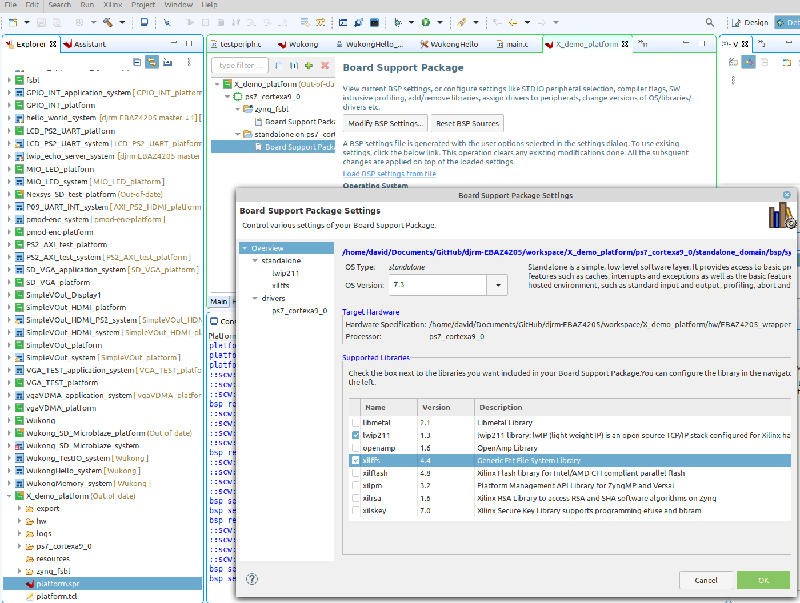
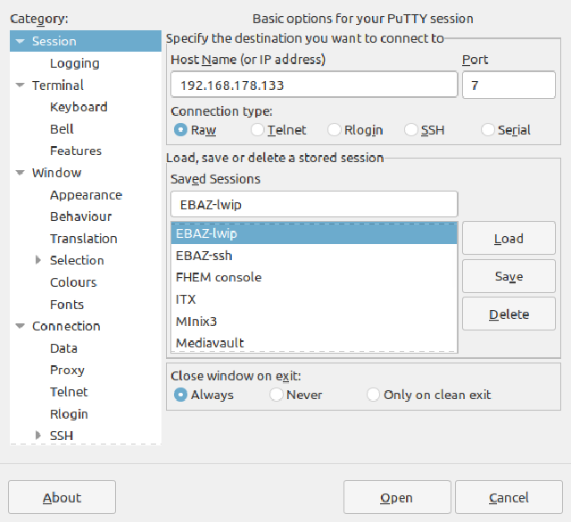
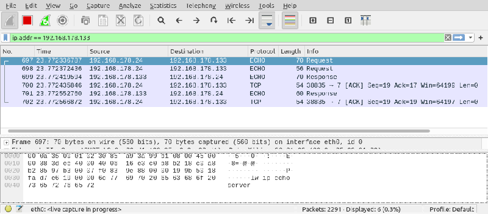

# Vivado export

## WIP note
note: there something wrong with demo .xsa file so use this instead
[wrapper.xsa](./bitstream/design_4_wrapper.xsa) its one I made earlier.

The folloing instructions create a working ping server using the above file.
goto step 'Vitis import'


## create wrapper.xsa file

To use the bitstream from the PS within Vitis the settings and binary bitstream need to be exported from Vivado and then imported into Visis as a platform object.

When you are happy that the bitstream will build properly and can be loaded onto the hardware then use the menu commads "File|Export|Export Hardware", button "Next", select "Include bitstream", button "Next", ok to use default dircetory and names, button "Next, button "Finish"

Take not of the location of the generated "*wrapper.xsa" file it is this which is imported into Vitis.

### console log ...

```
Sourcing tcl script '/opt/Xilinx/Vivado/2020.2/scripts/Vivado_init.tcl'
start_gui
open_project /home/david/ebaz4205/EBAZ4205/EBAZ4205.xpr
open_project /home/david/ebaz4205/EBAZ4205/EBAZ4205.xpr
Scanning sources...
Finished scanning sources
INFO: [IP_Flow 19-234] Refreshing IP repositories
INFO: [IP_Flow 19-1704] No user IP repositories specified
INFO: [IP_Flow 19-2313] Loaded Vivado IP repository '/opt/Xilinx/Vivado/2020.2/data/ip'.
INFO: [IP_Flow 19-3899] Cannot get the environment domain name variable for the component vendor name. Setting the vendor name to 'user.org'.
open_project: Time (s): cpu = 00:00:16 ; elapsed = 00:00:07 . Memory (MB): peak = 7234.770 ; gain = 60.062 ; free physical = 1641 ; free virtual = 9907
update_compile_order -fileset sources_1
open_bd_design {/home/david/ebaz4205/EBAZ4205/EBAZ4205.srcs/sources_1/bd/EBAZ4205/EBAZ4205.bd}
Reading block design file </home/david/ebaz4205/EBAZ4205/EBAZ4205.srcs/sources_1/bd/EBAZ4205/EBAZ4205.bd>...
Adding component instance block -- xilinx.com:ip:processing_system7:5.5 - processing_system7_0
Adding component instance block -- xilinx.com:ip:proc_sys_reset:5.0 - proc_sys_reset_0
Adding component instance block -- xilinx.com:ip:xlconcat:2.1 - xlconcat_0
Adding component instance block -- xilinx.com:ip:xlconcat:2.1 - xlconcat_1
Adding component instance block -- xilinx.com:ip:xlconstant:1.1 - xlconstant_0
Successfully read diagram <EBAZ4205> from block design file </home/david/ebaz4205/EBAZ4205/EBAZ4205.srcs/sources_1/bd/EBAZ4205/EBAZ4205.bd>
write_hw_platform -fixed -include_bit -force -file /home/david/ebaz4205/EBAZ4205/EBAZ4205_wrapper.xsa
INFO: [Vivado 12-4895] Creating Hardware Platform: /home/david/ebaz4205/EBAZ4205/EBAZ4205_wrapper.xsa ...
INFO: [Hsi 55-2053] elapsed time for repository (/opt/Xilinx/Vivado/2020.2/data/embeddedsw) loading 0 seconds
INFO: [Vivado 12-12467] The Hardware Platform can be used for Hardware
INFO: [Vivado 12-4896] Successfully created Hardware Platform: /home/david/ebaz4205/EBAZ4205/EBAZ4205_wrapper.xsa
```

# Vitis import

## Launch Vitis IDE then make a new platform project
Use menu commands "File"|"New"|"Platform Project"
### Hardware Specification
Supply a name (I add "_platform" to make it clear what it is) i.e. "demo_platform"
Click on "Next", Select "Create a new platform from hardware (XSA)"
Browse for xsa file created previously
### Software specification
Operating syatem, Select "standalone"
Processor, select "ps7_cortext9_0"
### Boot components
Generate boot components "checked"
### Finally
Select "Finish"

### Configure platform
Click on 'platform.spr' in vitis explorer
Click on 'Modify BSP Settings'
Check supported libraries, "lwip211", and "xilffs"
Click "OK"



### Build platform
Right click on platform in pvitis explorer, select "Build Project"
(Build took 18 seconds)

## From within Vitis make new application
Use menu commands "File"|"New"|"Application Project"
on the welcome screen(if shown), Select "Next"
Select a platform (the one just made) "X_demo_platform"
Click "Next"
on "Application Project Details" screen
Supply name e.g.  X_lwip (applicatyion will be automatically appended here)
use defaults for remaining items, clicj "Next"
on "Domain" screen use defaults and click "Next"

### Template selection

To check TCP/IP configuration select "lwip Echo Server"
Click "Finish"

## lwip TCP configuration

Find main.c in the source tree and look for settings to change for your own system

```
    / * initialize IP addresses to be used * /
	IP4_ADDR(&ipaddr,  192, 168,   1, 10);
	IP4_ADDR(&netmask, 255, 255, 255,  0);
	IP4_ADDR(&gw,      192, 168,   1,  1);
```
In my case I changed ipaddr to 192,168,178,133 and gw to 192,168,178,1 your setting will be different.
ipaddr should be unique on your network, gw is the address of your router. netmask is ok as is in most cases.
Alternativly there is code there to use DHCP to get an IP address, (not tested)
save the file main.c

## build the application

Select the project in Vitis explorer
Right click and select "Build Project"
(build took 7 seconds)

## run the application

Right click and select "Run As"|"Launch Hardware"
log of programing commands

```
initializing
  0%    0MB   0.0MB/s  ??:?? ETA
 54%    1MB   2.0MB/s  ??:?? ETA
 95%    1MB   1.8MB/s  ??:?? ETA
100%    1MB   1.8MB/s  00:01    

Downloading Program -- /home/david/Documents/GitHub/djrm-EBAZ4205/workspace/X_lwip/Debug/X_lwip.elf
	section, .text: 0x00100000 - 0x00114397
	section, .init: 0x00114398 - 0x001143a3
	section, .fini: 0x001143a4 - 0x001143af
	section, .rodata: 0x001143b0 - 0x00114d87
	section, .data: 0x00114d88 - 0x00115957
	section, .eh_frame: 0x00115958 - 0x0011595b
	section, .mmu_tbl: 0x00118000 - 0x0011bfff
	section, .init_array: 0x0011c000 - 0x0011c003
	section, .fini_array: 0x0011c004 - 0x0011c007
	section, .bss: 0x00200000 - 0x00408033
	section, .heap: 0x00408034 - 0x0041203f
	section, .stack: 0x00412040 - 0x0041d83f

  0%    0MB   0.0MB/s  ??:?? ETA
 85%    0MB   0.2MB/s  ??:?? ETA
100%    0MB   0.2MB/s  00:00    
Setting PC to Program Start Address 0x00100000

Successfully downloaded /home/david/Documents/GitHub/djrm-EBAZ4205/workspace/X_lwip/Debug/X_lwip.elf
Info: ARM Cortex-A9 MPCore #0 (target 2) Stopped at 0xff73454 (Suspended)
_vector_table() at asm_vectors.S: 50
50: 	B	_boot
xsct% Info: ARM Cortex-A9 MPCore #0 (target 2) Running
```

## !! important note !!
During programming it is important to stop the ordinary boot process.
I press 'd' at the serial consold to interrupt it and enter 'Uboot'

```
U-Boot 2020.01 (Mar 01 2021 - 17:57:40 +0000)

CPU:   Zynq 7z010
Silicon: v3.1
Model: Zynq Zed Development Board
DRAM:  ECC disabled 256 MiB
Flash: 0 Bytes
NAND:  128 MiB
MMC:   mmc@e0100000: 0
Loading Environment from SPI Flash... Invalid bus 0 (err=-19)
*** Warning - spi_flash_probe_bus_cs() failed, using default environment

In:    serial@e0001000
Out:   serial@e0001000
Err:   serial@e0001000
Net:   
ZYNQ GEM: e000b000, mdio bus e000b000, phyaddr 0, interface gmii

Warning: ethernet@e000b000 using MAC address from DT
eth0: ethernet@e000b000
Hit any key to stop autoboot:  0 
Zynq> 

-----lwIP TCP echo server ------
TCP packets sent to port 6001 will be echoed back
Start PHY autonegotiation 
Waiting for PHY to complete autonegotiation.
Auto negotiation error 
Phy setup error 
Phy setup failure init_emacps 
Board IP: 192.168.178.133
Netmask : 255.255.255.0
Gateway : 192.168.178.1
TCP echo server started @ port 7
Ethernet Link down
```

## access running lwip server

```
pi@rak-gateway:~ $ ping 192.168.178.133
PING 192.168.178.133 (192.168.178.133) 56(84) bytes of data.
64 bytes from 192.168.178.133: icmp_seq=1 ttl=255 time=4.20 ms
64 bytes from 192.168.178.133: icmp_seq=2 ttl=255 time=3.29 ms
64 bytes from 192.168.178.133: icmp_seq=3 ttl=255 time=3.43 ms
64 bytes from 192.168.178.133: icmp_seq=4 ttl=255 time=3.09 ms
64 bytes from 192.168.178.133: icmp_seq=5 ttl=255 time=2.90 ms
^C
--- 192.168.178.133 ping statistics ---
5 packets transmitted, 5 received, 0% packet loss, time 9ms
rtt min/avg/max/mdev = 2.904/3.382/4.199/0.450 ms
```

# echo server test

## putty 




## wireshark




